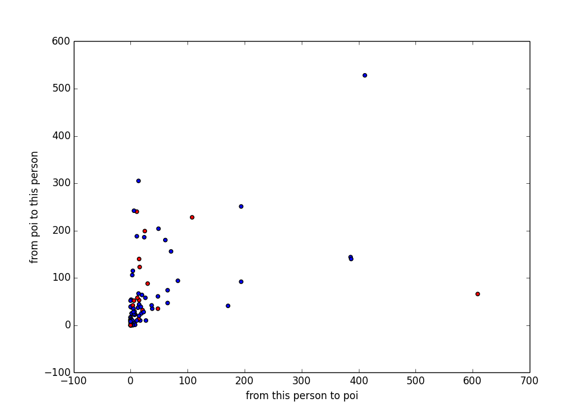
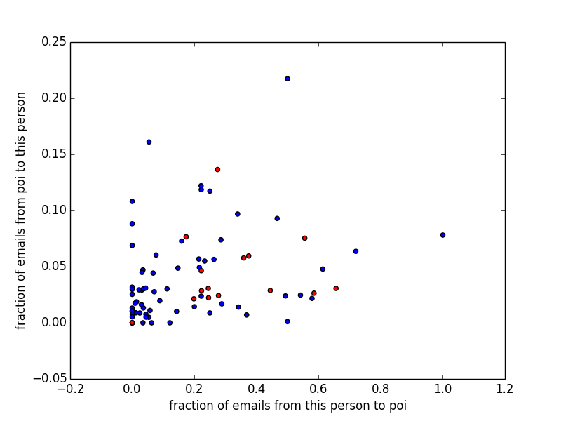

# Identifying-Fraud-from-the-Enron-Dataset
Project - 06 , Udacity Data Analyst Nanodegree


**Summarize for us the goal of this project and how machine learning is useful in trying to accomplish it. As part of your answer, give some background on the dataset and how it can be used to answer the project question. Were there any outliers in the data when you got it, and how did you handle those?  [relevant rubric items: “data exploration”, “outlier investigation”]**

The goal for this project is to identify who's the person of interest. In other words, people who actually comitting the fraud in Enron. Their crimes include selling assets to shell companies at the end of each month, and buying them at the beginning of each month to avoid accounting losses. Hopefully if there are any other person that are not in the dataset, the machine learning can identify them based on the financial features and emails, whether the person is actually POI.

There are 146 person in the dataset, 18 of those are a person of interest (there are actually 35 persons). Since  email data is just a sample, there are missing POI data. It may cause the prediction to a little worse. There are 21 features in the dataset. 

The dataset is not without an error. Especially the financial features. Because not all POI in the dataset, we might want to add it by hand, and just put missing value for financial information. But this itself could lead an error, because machine learning could predict whether a person POI or not based on `NaN` value. So financial features is still being considered. This is the proportion of no-NaN features for each column.


```python
nan_summary = pd.DataFrame({'size': df.count(),
                            'no-nan': df.applymap(lambda x: pd.np.nan if x=='NaN' else x).count()},
                           index=df.columns)
nan_summary['no-nan-proportion'] = nan_summary['no-nan'] / nan_summary['size']
nan_summary
```


<div>
<table border="1" class="dataframe">
  <thead>
    <tr style="text-align: right;">
      <th></th>
      <th>no-nan</th>
      <th>size</th>
      <th>no-nan-proportion</th>
    </tr>
  </thead>
  <tbody>
    <tr>
      <th>salary</th>
      <td>95</td>
      <td>146</td>
      <td>0.650685</td>
    </tr>
    <tr>
      <th>to_messages</th>
      <td>86</td>
      <td>146</td>
      <td>0.589041</td>
    </tr>
    <tr>
      <th>deferral_payments</th>
      <td>39</td>
      <td>146</td>
      <td>0.267123</td>
    </tr>
    <tr>
      <th>total_payments</th>
      <td>125</td>
      <td>146</td>
      <td>0.856164</td>
    </tr>
    <tr>
      <th>exercised_stock_options</th>
      <td>102</td>
      <td>146</td>
      <td>0.698630</td>
    </tr>
    <tr>
      <th>bonus</th>
      <td>82</td>
      <td>146</td>
      <td>0.561644</td>
    </tr>
    <tr>
      <th>restricted_stock</th>
      <td>110</td>
      <td>146</td>
      <td>0.753425</td>
    </tr>
    <tr>
      <th>shared_receipt_with_poi</th>
      <td>86</td>
      <td>146</td>
      <td>0.589041</td>
    </tr>
    <tr>
      <th>restricted_stock_deferred</th>
      <td>18</td>
      <td>146</td>
      <td>0.123288</td>
    </tr>
    <tr>
      <th>total_stock_value</th>
      <td>126</td>
      <td>146</td>
      <td>0.863014</td>
    </tr>
    <tr>
      <th>expenses</th>
      <td>95</td>
      <td>146</td>
      <td>0.650685</td>
    </tr>
    <tr>
      <th>loan_advances</th>
      <td>4</td>
      <td>146</td>
      <td>0.027397</td>
    </tr>
    <tr>
      <th>from_messages</th>
      <td>86</td>
      <td>146</td>
      <td>0.589041</td>
    </tr>
    <tr>
      <th>other</th>
      <td>93</td>
      <td>146</td>
      <td>0.636986</td>
    </tr>
    <tr>
      <th>from_this_person_to_poi</th>
      <td>86</td>
      <td>146</td>
      <td>0.589041</td>
    </tr>
    <tr>
      <th>poi</th>
      <td>146</td>
      <td>146</td>
      <td>1.000000</td>
    </tr>
    <tr>
      <th>director_fees</th>
      <td>17</td>
      <td>146</td>
      <td>0.116438</td>
    </tr>
    <tr>
      <th>deferred_income</th>
      <td>49</td>
      <td>146</td>
      <td>0.335616</td>
    </tr>
    <tr>
      <th>long_term_incentive</th>
      <td>66</td>
      <td>146</td>
      <td>0.452055</td>
    </tr>
    <tr>
      <th>email_address</th>
      <td>111</td>
      <td>146</td>
      <td>0.760274</td>
    </tr>
    <tr>
      <th>from_poi_to_this_person</th>
      <td>86</td>
      <td>146</td>
      <td>0.589041</td>
    </tr>
  </tbody>
</table>
</div>


we can see that of all the features in the dataset, only `poi` feature, the label of this machine learning doesn't have any missing value. This is good, since the machine learning need the feature otherwise we the data is meaningless without label. On the other hand, feature that has too many missing values, like `loan_advances`, would not benefit the model.

In the dataset, there's an outlier which is 'TOTAL'. This should be total of numerical features that every person in ENRON dataset has, but counted as a person. This is an outlier. we should exclude this because it's not a data that we have attention too. Next I begin to observe an outlier, and I have 2 out of 4 outlier that identified as POI. Since this is the data that we're paying attention, we don't exclude the outlier. 

**What features did you end up using in your POI identifier, and what selection process did you use to pick them? Did you have to do any scaling? Why or why not? As part of the assignment, you should attempt to engineer your own feature that does not come ready-made in the dataset -- explain what feature you tried to make, and the rationale behind it. (You do not necessarily have to use it in the final analysis, only engineer and test it.) In your feature selection step, if you used an algorithm like a decision tree, please also give the feature importances of the features that you use, and if you used an automated feature selection function like SelectKBest, please report the feature scores and reasons for your choice of parameter values.  [relevant rubric items: “create new features”, “properly scale features”, “intelligently select feature”]**

I added new features such as fraction in which this person sent email to POI persons, and fraction POI persons send emails to this persons. The reason behind this is because there's could be that if this person have higher frequencies of sending and receiving email with POI persons, this person could end up being POI himself. But this turns out filtered itself in SelectPercentile, therefore have no effect on the performance. I also added feature such as text words, based on the email of a person.

Without text feature I achieve: ```Precision: 0.27753	Recall: 0.24700```

With text feature I achieve: ```Precision: 0.36853	Recall: 0.35950```


I scaled any numerical features. The reason behind this because the algorithm that I'm using SGDClassifier consider the features to both dependent of each other. It doesn't like linear regression where features is independent of each other (based on coefficient). SGDClassifier also has l2 penalty, but since I see that scaling makes the model better, I decide to scale it. 

I select numerical features based on the 21 percentile using SelectPercentile. I tried variety of percentiles that maximize both precision and recall. When both are deliver some trade-off, I determine the highest based on given F1 score.

Range of percentiles used and the corresponding precision and recall:


* 10% : Precision: 0.34855	Recall: 0.34350
* 20% : Precision: 0.34731	Recall: 0.34800
* 21% : Precision: 0.36853	Recall: 0.35950	BEST F1 Score!
* 30% : Precision: 0.35031	Recall: 0.37150
* 40% : Precision: 0.34158	Recall: 0.35900
* 50% : Precision: 0.34586	Recall: 0.36350


Final features used are:

```
['deferred_income',
 'bonus',
 'total_stock_value',
 'salary',
 'exercised_stock_options']
```

**What algorithm did you end up using? What other one(s) did you try? How did model performance differ between algorithms?  [relevant rubric item: “pick an algorithm”]**

I ended up choosing Gaussian Naive Bayes, as it gives the default best performance compared to any other classifier that I tried. The performance default for each of the algorithm are as follows:

```Python
from sklearn.naive_bayes import GaussianNB ##Default(Tuned): Precision: 0.29453	Recall: 0.43650
from sklearn.tree import DecisionTreeClassifier ##Default: Precision: 0.14830	Recall: 0.05450
from sklearn.ensemble import RandomForestClassifier ##Default: Precision: 0.47575 Recall: 0.20600, Longer time
from sklearn.linear_model import SGDClassifier ##Tuned: Precision: 0.35534	Recall: 0.34450, BEST!
```

**What does it mean to tune the parameters of an algorithm, and what can happen if you don’t do this well?  How did you tune the parameters of your particular algorithm? (Some algorithms do not have parameters that you need to tune -- if this is the case for the one you picked, identify and briefly explain how you would have done it for the model that was not your final choice or a different model that does utilize parameter tuning, e.g. a decision tree classifier).  [relevant rubric item: “tune the algorithm”]**

Since the algorithm that I use now are SGDClassifier, I tune its parameters. Tuning an algorithm is important since all of the estimator method and its parameters could be vary depend on the problem that we have. By tuning the algorithm, we will fit the parameters to our specific problem. By default the estimator take `hinge` which would be the linear SVM. the alpha is the learning_rate. Too small will make the machine learning learning very slow. Too high for the learning rate, it will make overshooting, the model can't make it further to the best parameter.

I use GridSearchCV for tuning the algorithm. Not all of the parameters I hand over to GridSearchCV. For the text learning `l2` penalty is must since it regularized sparse features. `cv` parameter in default is `StratifiedKFold`, which confirm with what `tester.py` used. StratifiedKFold is used when we have skew data, and we can bootstrap by resampling with folds. The scoring method used is F1 score.

**What is validation, and what’s a classic mistake you can make if you do it wrong? How did you validate your analysis?  [relevant rubric item: “validation strategy”]**

Validation is importance when we want to test the model against future data. While the drawback is we have smaller to trained, but it's useful to the the performance. We can't train the model using whole data and test it with the same one, as the model will already know what it's against and will perform excellently, and this called ***cheating*** in machine learning. Aside from forgetting to actually perform validation by splitting data into testing and training sets, another classic mistake is to not shuffle and split the testing and training sets adequately. If there are patterns in the way classes are represented or inserted into the main dataset (i.e., sequentially by class), this could lead to an uneven mix of data across classes in the training sets. As a result, the algorithm could wind up being training mainly on data from one class, but tested mainly on data from another, leading to poor performance.
              For this effort, all of the testing and training datasets were created using StratifiedShuffleSplit in Scikit-Learn, which shuffled the data and split it into 1000 different sets, called folds. This was already implemented in the testing function provided by Udacity, but was also used in the GridSearchCV function in order to best identify the optimal combination of parameters, and to be consistent with the Udacity testing function. 
              I have validated my dataset with the help of the test_classifier 0 function that used the sklearn StratifiedShuffleSplit 0 function to do the splitting of the data into a training set and test set. The parameter for n_iter (represented by the folds variable) was 1000. That means the model is run 1000 different times and for each iteration a random test data set is used (this test dataset still comes from the original dataset and is usually different from previous test data sets). 


**Give at least 2 evaluation metrics and your average performance for each of them.  Explain an interpretation of your metrics that says something human-understandable about your algorithm’s performance. [relevant rubric item: “usage of evaluation metrics”]**

I will use precision and recall for my evaluation metrics. As this metrics can identify the accuracy of skewed data. From the performance that I got, I have good precision and good recall. That means the model is able to identify the when the real POI comes out, and have good probability of flagging POI person.

StratifiedShuffleSplit is used when we take advantage of skew data but still keeping proportion of labels
If we using usual train test split, it could be there's no POI labels in the test set, or even worse in train set
which would makes the model isn't good enough. If for example the StratifiedShuffleSplit have ten folds, then every folds
will contains equal proportions of POI vs non-POI

## Optimize Feature Selection/Engineering:
### Adding new features

- After plotting the number of emails from this person to poi vs the number of emails to this person from poi, I don't see any pattern between the red points(poi) and the blue points(non-poi).

	

	But since we already got the number of emails from/to poi and the total number of from/to emails of each person, I've the strong intuition that the fraction of emails to this person from poi and from this person to poi might be helpful. So two new features named "fraction_to_poi" and "fraction_from_poi" are added in my dataset. From the new plot, we can see the red points(poi) tend to cluster in the middle of the graph.

	

- Also I think the content of emails may reveal difference between poi and non-poi.
  - First, I extract features from all the email text data and create labels based on whether the author is poi or not.
  - Then I use naive bayes to create a classification and fit the above data.
  - Finally I use that classification to make prediction on each person's email text file. The new feature is the prediction result.(the helper methods for the above process are in extract_email.py, poi_by_email.py and poi_id.py files).

### Univariate Feature Selection
First, I tried each feature with GaussianNB and rank these features by the f1 score. The result as follow:

```
(feature_name,precision,recall,f1)
('total_stock_value', 0.6325842696629214, 0.2815, 0.38961937716262973)
('exercised_stock_options', 0.5232342007434945, 0.2815, 0.3660598179453836)
('bonus', 0.5297549591598599, 0.227, 0.3178158907945397)
('deferred_income', 0.5125148986889154, 0.215, 0.302923564635435)
('restricted_stock_deferred', 0.15070454374199382, 1.0, 0.26193438543644815)
('director_fees', 0.149947518368571, 1.0, 0.26079019428869477)
('long_term_incentive', 0.5395569620253164, 0.1705, 0.2591185410334346)
('fraction_to_poi', 0.286203941730934, 0.167, 0.210925165772024)
('salary', 0.535632183908046, 0.1165, 0.19137577002053388)
('restricted_stock', 0.5065217391304347, 0.1165, 0.18943089430894308)
('total_payments', 0.43796992481203006, 0.1165, 0.18404423380726698)
('loan_advances', 0.54337899543379, 0.0595, 0.10725552050473186)
('text_learn_pred', 0.49122807017543857, 0.056, 0.10053859964093358)
('other', 0.2916666666666667, 0.0595, 0.09883720930232558)
('from_this_person_to_poi', 0.1925566343042071, 0.0595, 0.09090909090909091)
('shared_receipt_with_poi', 0.1731748726655348, 0.051, 0.07879490150637311)
('deferral_payments', 0, 0, 0)
('expenses', 0, 0, 0)
('to_messages', 0, 0, 0)
('from_poi_to_this_person', 0, 0, 0)
('from_messages', 0, 0, 0)
('fraction_from_poi', 0, 0, 0)
```

We can see, based on the f1 score, the top 10 most important features are ['total_stock_value','exercised_stock_options','bonus','deferred_income','restricted_stock_deferred','director_fees','long_term_incentive','fraction_to_poi','salary','restricted_stock'].

Of all the three newly added features, 'fraction_to_poi' is quite an important features in those email features. For some reasons, the true positive number is zero for 'fraction_from_poi' feature, so all the metrics results are invalid for that feature. Also, the added 'text_learn_pred' feature don't perform well in both precision and recall.

Second, I try to combine those best features in the above result form. With the number of K increases, below is the result for the K best features combination:

```
(k,precision,recall,f1)
(1, 0.6325842696629214, 0.2815, 0.38961937716262973)
(2, 0.43779160186625193, 0.2815, 0.34266585514303105)
(3, 0.4398148148148148, 0.3325, 0.3787015945330296)
(4, 0.5112285336856011, 0.387, 0.44052361980648835)
(5, 0.15070454374199382, 1.0, 0.26193438543644815)
(6, 0.1668613382279326, 1.0, 0.286000286000286)
(7, 0.1668613382279326, 1.0, 0.286000286000286)
(8, 0.1668613382279326, 1.0, 0.286000286000286)
(9, 0.1668613382279326, 1.0, 0.286000286000286)
(10, 0.1668613382279326, 1.0, 0.286000286000286)
```

From the result we see that when K is greater than or equal to five, the recall value is always 1. This means the 'restricted_stock_deferred' feature is too strong for the fit and it causes overfitting. Also, from the first result, we can see 'director_fees' is also a feature that will cause bias. So I remove these two features and repeat second step. Result as follow:

```
(k,precision,recall,f1)
(1, 0.6325842696629214, 0.2815, 0.38961937716262973)
(2, 0.43779160186625193, 0.2815, 0.34266585514303105)
(3, 0.4398148148148148, 0.3325, 0.3787015945330296)
(4, 0.5112285336856011, 0.387, 0.44052361980648835)
(5, 0.5184192900200938, 0.387, 0.44317205840251933)
(6, 0.5184192900200938, 0.387, 0.44317205840251933)
(7, 0.4831056793673616, 0.336, 0.3963432615747567)
(8, 0.4801488833746898, 0.387, 0.42857142857142855)
(9, 0.41869158878504675, 0.336, 0.37281553398058254)
(10, 0.5118050266565118, 0.336, 0.4056746151524298)
```

From the result, the combination of top 5 features provide the best outcome in both precision and recall. So my final feature choice is ['total_stock_value','exercised_stock_options','bonus','deferred_income','long_term_incentive']. Although new features are added in my dataset, all of them are not selected.


## Reference
- [Precision Wiki](https://en.wikipedia.org/wiki/Precision_and_recall)
- [Designing ML Models](http://nerds.airbnb.com/designing-machine-learning-models/)
- [Cross-validation](https://en.wikipedia.org/wiki/Cross-validation_(statistics))
- [Introduction to Machine Learning (Udacity)](https://www.udacity.com/course/viewer#!/c-ud120-nd)
- [MITx Analytics Edge](https://www.edx.org/course/analytics-edge-mitx-15-071x-0)
- [scikit-learn Documentation](http://scikit-learn.org/stable/documentation.html)
- [Enron data set](https://www.cs.cmu.edu/~./enron/)
- [Visualization of POI](http://www.nytimes.com/packages/html/national/20061023_ENRON_TABLE/index.html)
- [Enron Analysis](https://olegleyz.github.io/enron_classifier.html)
